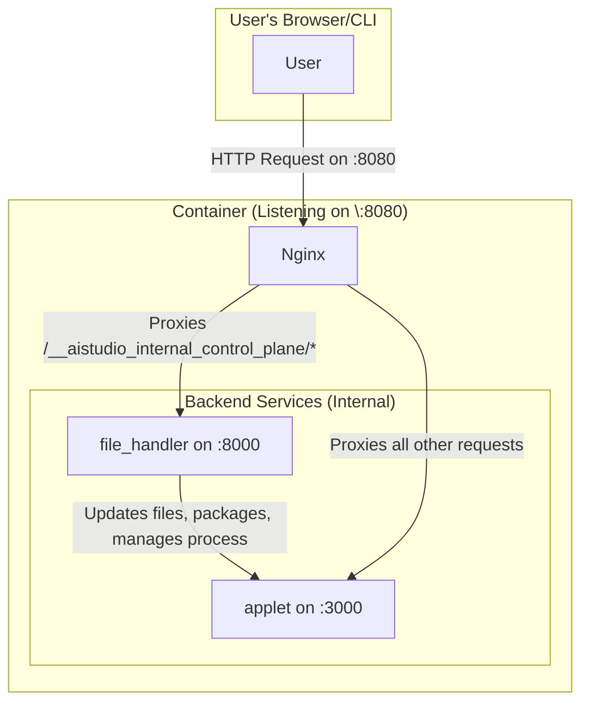

## Architecture



## TODO

- Add IAM authentication
- CORS for AIS only

## Deploy The app

```bash
$ gcloud beta run deploy hot-reload --source . --region us-central1 --max 1
```

## Docker Setup

Running the container manually:

```bash
docker build --build-arg APP_SOURCE=next -t dev-env:latest .
docker run --name applet-dev -p 8080:8080 dev-env:latest
```

Using the build script:

```
# Build uses the arguments from .dockerenv
./build
docker run -p 8080:8080 dev-env:latest
```

By default, the Docker instance listens at port 8080. Nginx proxies from the entry point to
the App or the Control Plane API.

All requests to the Control Plane API are prefixed by `/__aistudio_internal_control_plane/*`. 
Everything else is proxied to the Applet server.

### Advanced debugging

Get to the container files

```
docker exec -it applet-dev /bin/bash
```

Stream container logs:

```
docker logs applet-dev -f
```


## Deploy to registry flow

Note: this needs prior setup:

- a gcp project with artifact registry setup
- a docker hub setup
- authentication link setup (via gcloud or service account) from docker hub to artifact registry

To build & push a new image:

```
docker build -t cloud-run-hot-reload:dev .
docker tag cloud-run-hot-reload:dev us-west1-docker.pkg.dev/cloudrun-ui-dev-xd/cloud-run-applet-dev/applet-server-image:dev
docker push us-west1-docker.pkg.dev/cloudrun-ui-dev-xd/cloud-run-applet-dev/applet-server-image:dev
```

IMPORTANT: updating a tag will update existing containers using that tag (progressibly)

## API Endpoint `curl` Commands

Here are the commands, assuming your control plane is running on `localhost:8080`.

#### 1. Health Check (`/health`)
Checks if the control plane API is alive and responsive.

```bash
curl -i http://localhost:8080/__aistudio_internal_control_plane/health
```
**Expected Output:**
A `200 OK` status with a JSON body indicating a healthy status and a timestamp.
```json
{
  "status": "healthy",
  "timestamp": "2023-10-27T10:00:00Z"
}
```

---

#### 2. File Sync (`/sync`)
Writes and deletes files in the application directory. The file content must be Base64 encoded.

**To create/update a file:**
Using nextjs as an example:

```bash
curl -X POST http://localhost:8080/__aistudio_internal_control_plane/sync \
  -H "Content-Type: application/json" \
  -d "{
    \"files\": {
        \"app/page.js\": \"$(cat next/app/page.js | base64)\"
    },
    \"deleted_file_paths\": []
}"
{"message":"Files synced successfully","success":true}
```
**Expected Output:** A success message. You can verify the file was created at `/app/applet/src/index.js`.

**To delete a file:**
```bash
curl -X POST http://localhost:8080/__aistudio_internal_control_plane/sync \
-H "Content-Type: application/json" \
-d '{
    "files": {},
    "deleted_file_paths": ["src/index.js"]
}'
```
**Expected Output:** A success message. You can verify the file at `/app/applet/src/index.js` is now gone.


Automatic npm installs & pruning unused packages:

```bash
❯ curl -X POST http://localhost:8080/__aistudio_internal_control_plane/sync \                                                                                                5s 18:12:49
  -H "Content-Type: application/json" \
  -d "{
    \"files\": {
        \"package.json\": \"$(cat next/package.json | base64)\"
    },
    \"deleted_file_paths\": []
}"
```

TIP: make a change to `package.json` first!

---

#### 3. Install Dependencies (`/dev/install`)
Runs `npm install` in the application directory.

**Standard Install:**
```bash
curl -X POST http://localhost:8080/__aistudio_internal_control_plane/dev/install
```
**Install with Extra Arguments (e.g., `--legacy-peer-deps`):**
```bash
curl -X POST http://localhost:8080/__aistudio_internal_control_plane/dev/install \
-H "Content-Type: application/json" \
-d '{
    "extra_args": ["--legacy-peer-deps"]
}'
```
**Expected Output:** A JSON response indicating success or failure, including the exit code and any output from `npm`.

---

#### 4. Check Dev Server Status (`/dev/status`)
Checks if the dev server process is running.

```bash
curl http://localhost:8080/__aistudio_internal_control_plane/dev/status
```
**Expected Output (when not running):**
```json
{"running":false,"pid":null}
```
**Expected Output (when running):**
```json
{"running":true,"pid":12345}
```

---

#### 5. Start Dev Server (`/dev/start`)
Starts the dev server process based on `package.json`.

**Start on the default port (3000):**
```bash
curl -X POST http://localhost:8080/__aistudio_internal_control_plane/dev/start
```
**Start on a specific port (e.g., 5173):**
```bash
curl -X POST http://localhost:8080/__aistudio_internal_control_plane/dev/start \
-H "Content-Type: application/json" \
-d '{"port": 5173}'
```
**Expected Output:**
A `202 Accepted` status indicating the operation was initiated, along with the new process ID (PID).
```json
{"operation_initiated":true,"pid":12345}
```
You can then use the `/dev/status` and `/dev/logs` endpoints to monitor it.

---

#### 6. Stream Logs (`/dev/logs`)
Streams the `stdout` and `stderr` from the running dev server using Server-Sent Events (SSE).

**This command will hang and keep the connection open to receive logs.** Press `Ctrl+C` to stop.
```bash
# Use -N to disable buffering for immediate output
curl -N http://localhost:8080/__aistudio_internal_control_plane/dev/logs
```
**Expected Output:**
A stream of `data:` lines as the dev server produces output.
```
data: Connected to log stream.

data: --- Server started with PID 12345 on port 3000 ---

data: > test-app@1.0.0 dev
data: > echo 'Starting dev server...' && sleep 3600

data: Starting dev server...
```

---

#### 7. Stop Dev Server (`/dev/stop`)
Stops the running dev server process.

```bash
curl -X POST http://localhost:8080/__aistudio_internal_control_plane/dev/stop
```
**Expected Output:**
A success message. You can confirm by calling `/dev/status` again, which should show `running: false`.
```json
{"stopped":true,"message":"Dev server stopped successfully"}
```

---

#### 8. Restart Dev Server (`/dev/restart`)
A convenient endpoint to stop the existing process (if any) and start a new one.

```bash
# This will restart using the default port
curl -X POST http://localhost:8080/__aistudio_internal_control_plane/dev/restart

# You can also specify a new port on restart
curl -X POST http://localhost:8080/__aistudio_internal_control_plane/dev/restart \
-H "Content-Type: application/json" \
-d '{"port": 8080}'
```
**Expected Output:**
Similar to `/dev/start`, it returns a `202 Accepted` with the new PID. Check the logs to see the "restarting" and "started" messages.
```json
{"operation_initiated":true,"pid":54321}
```
